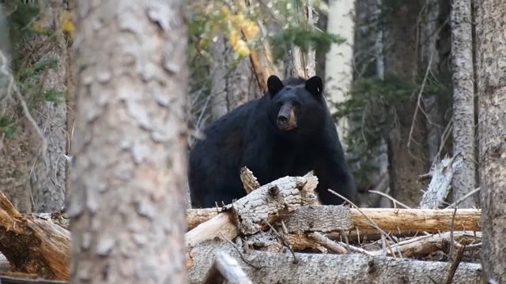
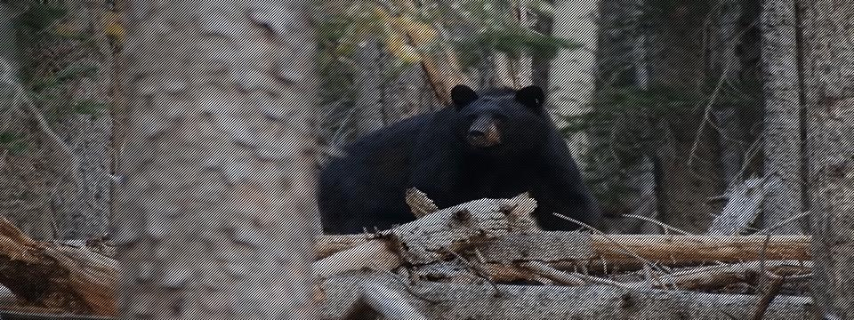
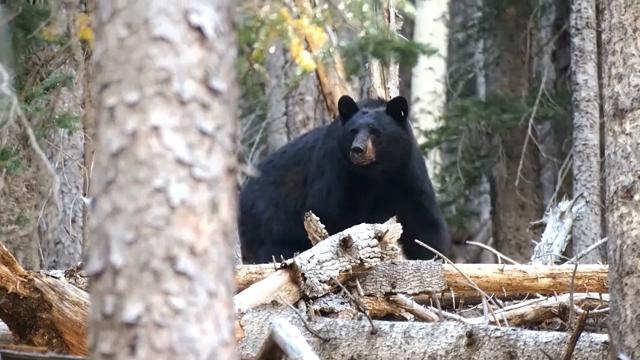
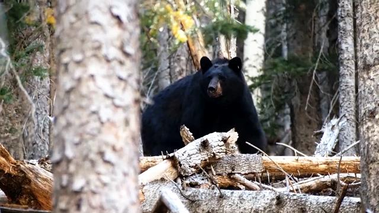
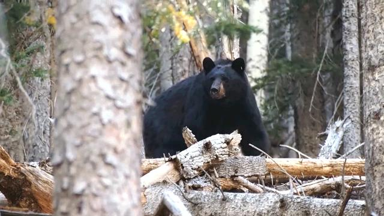
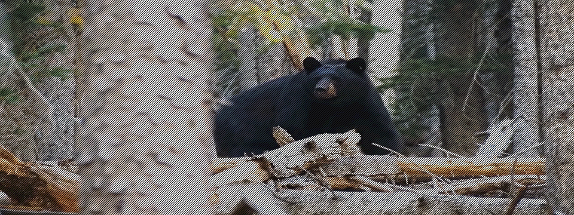
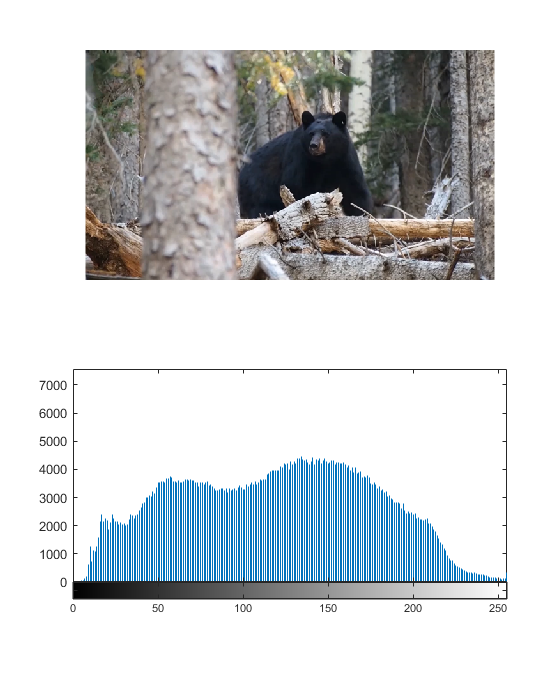

# 2021/02/02 미팅문서 사진

## 1. Original sampling 문제점
#### original image

#### 2:1 pixel sampling

 * 전체적인 밝기 저하

## 2. Histogram matching
#### A_adjust

 * 0~255 pixel value에서 75%~100%에 해당하는 pixel은 saturation
 * histogram의 target 이미지

#### A_histeq

 * gamma correction 후 histogram equalization
 * histogram matching의 source 이미지

#### A_match

 * A_match = imhistmatch(A_histeq, A_adjust)

## 3. Stretching에 적용
#### original image

#### histogram matching stretching

## 4. Logarithmic contrast

